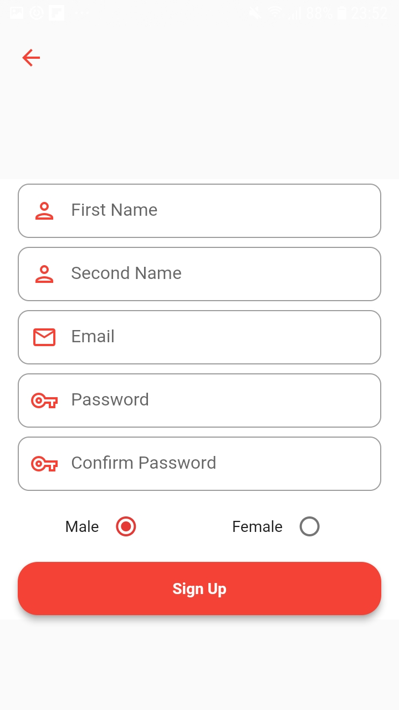
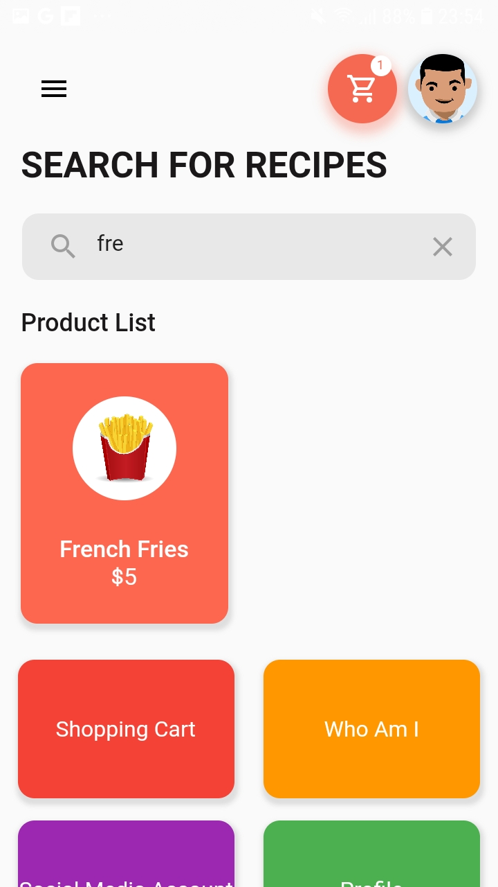
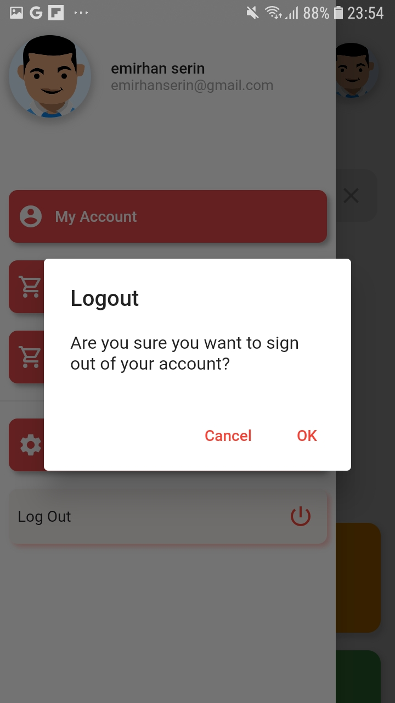

#Crazy Fast Food

This app is a fast food shopping app made with Flutter. Database operations are carried out with Firebase. I used provider for stage management

LogIn and SignUp Page

You can chooise food from home page and you can search food that you want 

  
  

You can increase and decrease your number of product from selected food page

  

After you can add extra product

  

You can see your products from shopping cart page. You can increase, decrease and delete your product. Also you can check your extras.

  
  

And you can spend money with payment Page. Also there is an animation in credit cart.

  

Other ScreenShots

  
  

